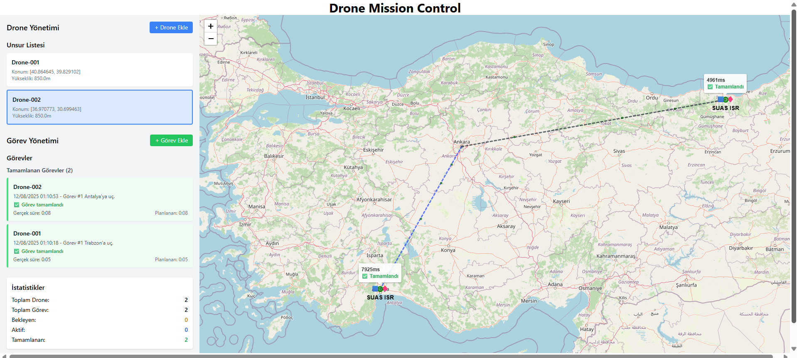

# Drone Görev Kontrol Sistemi

Drone Görev Kontrol Sistemi, drone görevlerini verimli bir şekilde planlamak, yürütmek ve izlemek için tasarlanmış web tabanlı bir uygulamadır.

## Kullanılan Teknolojiler

- **Frontend:** React, TypeScript, Tailwind CSS, Leaflet(2B Harita)  
- **Backend:** Node.js, Express, TypeScript  
- **Veri Tabanı:** PostgreSQL  

## Özellikler

- Özelleştirilebilir rotalarla drone görevleri planlama 
- Leaflet destekli etkileşimli harita arayüzü 

## Kurulum ve Çalıştırma

### Backend
cd backend
npm install
npm run dev

### Frontend
cd frontend
npm install
npm run dev